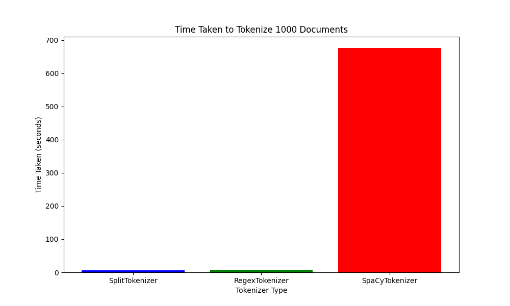

# HW1
## Data Processor
Plot time needed for 1000 documents (seconds):

Time Estimate:
- Average time per document (SplitTokenizer): 0.0065 seconds
- Average time per document (RegexTokenizer): 0.0077 seconds
- Average time per document (SpaCyTokenizer): 0.6769 seconds 
  
Estimated time to preprocess entire corpus:
- SplitTokenizer: 0.36 hours
- RegexTokenizer: 0.43 hours
- SpaCyTokenizer: 37.6 hours
  
My choice: 
SplitTokenizer is the fastest but less accurate, RegexTokenizer balances speed and accuracy, while SpaCyTokenizer is the most accurate but slowest. In practice, I will choose RegexTokenizer, as I need accuracy but I don't want to process the corpus for 37 hours.

ranker:
Weighted Term Frequency Scorer
The Weighted Term Frequency Scorer simply adds up the term frequencies for each query term in the document, but we multiply each term frequency by a weight. The weight for a term in the query can be based on its frequency within the query itself—meaning more frequently occurring terms in the query are given higher importance.
weight(w_i)=1+log(1+tf(w_i,q))

